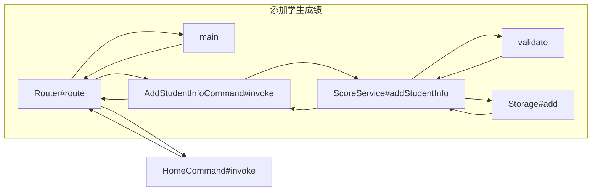
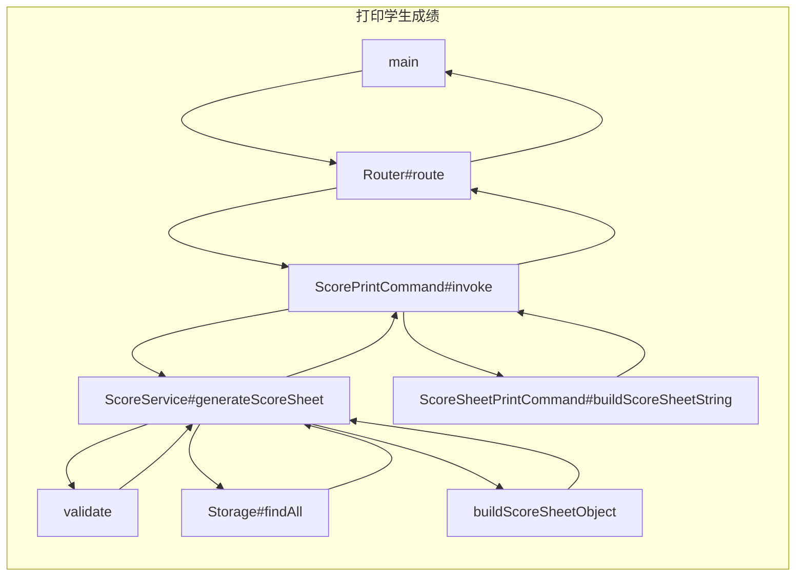
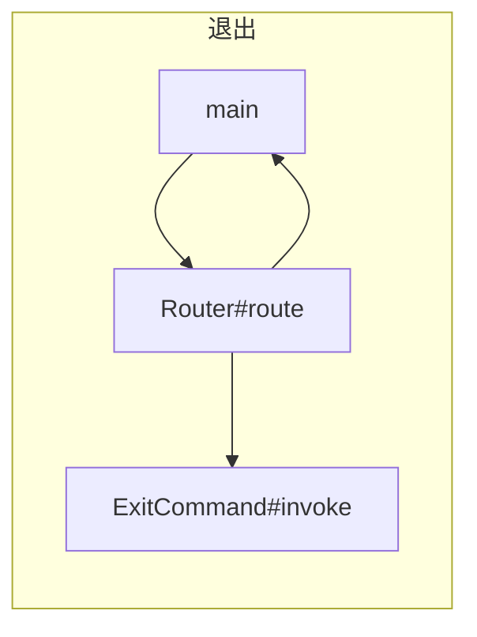

### 采用框架来解决

Router负责寻找响应者

Command负责各种具体的用户输入解析

Service负责核心计算

```mermaid
graph LR;
Router#route-->HomeCommand#invoke
HomeCommand#invoke-->Router#route
 subgraph 添加学生成绩
main-->Router#route
Router#route-->main
Router#route-->AddStudentInfoCommand#invoke
AddStudentInfoCommand#invoke-->Router#route
AddStudentInfoCommand#invoke-->ScoreService#addStudentInfo
ScoreService#addStudentInfo-->AddStudentInfoCommand#invoke
ScoreService#addStudentInfo-->validate
validate-->ScoreService#addStudentInfo
ScoreService#addStudentInfo-->Storage#add
Storage#add-->ScoreService#addStudentInfo
end
```

```mermaid
graph LR;
subgraph 打印学生成绩
main-->Router#route
Router#route-->main
Router#route-->ScorePrintCommand#invoke
ScorePrintCommand#invoke-->Router#route
ScorePrintCommand#invoke-->ScoreService#generateScoreSheet
ScoreService#generateScoreSheet-->ScorePrintCommand#invoke
ScoreService#generateScoreSheet-->validate
validate-->ScoreService#generateScoreSheet
ScoreService#generateScoreSheet-->Storage#findAll
Storage#findAll-->ScoreService#generateScoreSheet
ScoreService#generateScoreSheet-->buildScoreSheetObject
buildScoreSheetObject-->ScoreService#generateScoreSheet
ScorePrintCommand#invoke-->ScoreSheetPrintCommand#buildScoreSheetString
ScoreSheetPrintCommand#buildScoreSheetString-->ScorePrintCommand#invoke
end
```

```mermaid
graph LR;
 subgraph 退出
main-->Router#route
Router#route-->main
Router#route-->ExitCommand#invoke
end
```