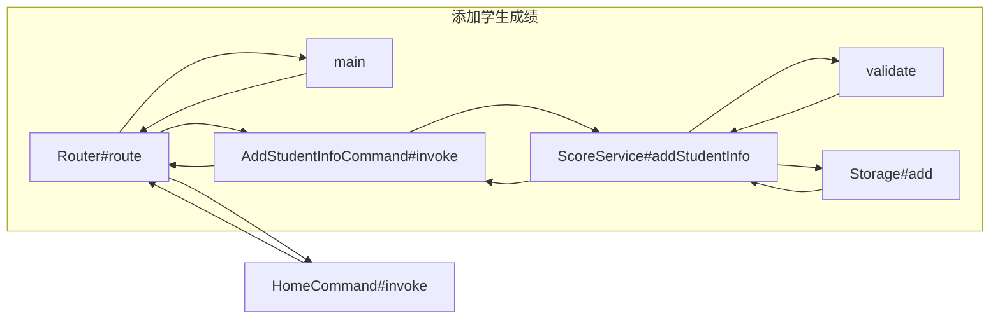
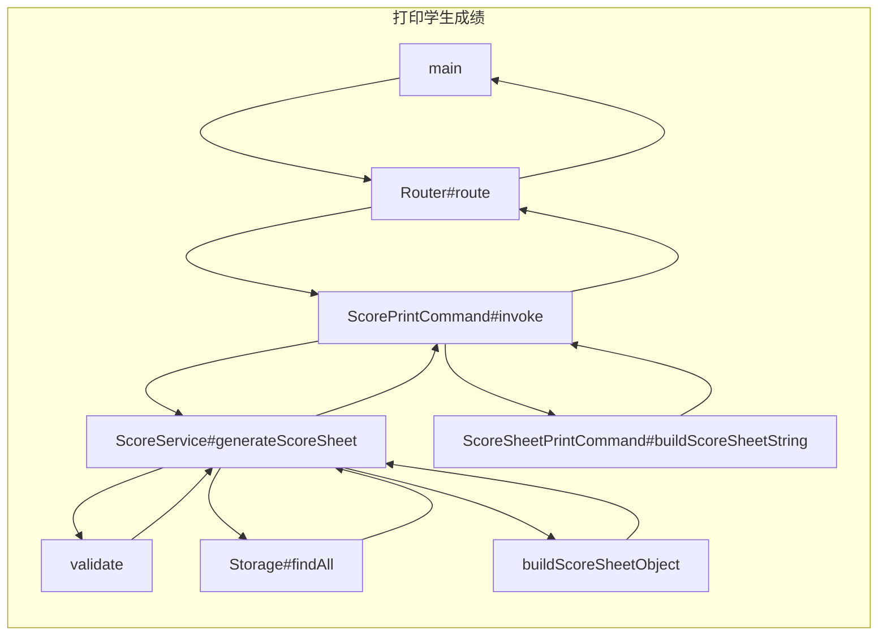
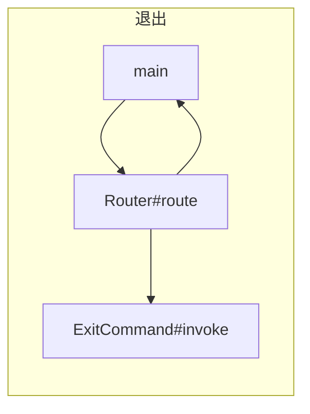
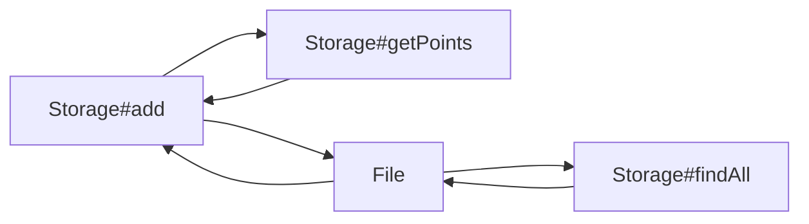

### 采用框架来解决

Router负责寻找响应者

Command负责各种具体的用户输入解析

Service负责核心计算





##### 改进需求：

1. 执行Storage#add前，调用getPoints计算加分项
2. 在调用Storage的add和findAll方法时，进行数据持久化处理



##### tasking：

Feature：student-grade-command

​	Scenario：主界面（45‘）

​		Given：Router#route

​		When：HomeCommand#invoke

​		Then：返回主界面视图

```
1. 添加学生
2. 生成成绩单
3. 退出请输入你的选择（1～3）：
```

------

​	Scenario：进入学生成绩界面（30‘）

​		Given：Router#route

​		When：输入1

​		Then：调用AddStudentInfoCommand#invoke

------

​	Scenario：添加学生成绩界面（30‘）

​		Given：Router#route

​		When：AddStudentInfoCommand#invoke

​		Then：返回添加学生成绩界面

```
请输入学生信息（格式：姓名, 学号, 学科: 成绩, ...），按回车提交：
```

------

Scenario：添加学生成绩（45‘）

​		Given：学生信息&&输入格式正确

​		When：ScoreService#addStudentInfo

​		Then：调用Storage#add保存数据，并打印提示信息，返回到主界面视图

```
学生xxx的成绩被添加
```

​		

​		Given：学生信息&&输入格式不正确

​		When：ScoreService#addStudentInfo

​		Then：返回添加学生成绩界面Router#route(1)

------

​	Scenario：持久化学生数据（30‘）

​		Given：学生信息

​		When：Storage#add

​		Then：调用Storage#getPoints计算加分，将学生信息保存到文件

------

​	Scenario：计算加分策略（30‘）

​		Given：学生信息

​		When：Storage#getPoints&&学生是少数民族

​		Then：成绩+10分


​		Given：学生信息

​		When：Storage#getPoints&&学生有艺术特长

​		Then：成绩+15分


​		Given：学生信息

​		When：Storage#getPoints&&学生有体育特长

​		Then：成绩+20分

------

​	Scenario：打印学生成绩界面（5‘）

​		Given：Router#route

​		When：输入2

​		Then：调用ScorePrintCommand#invoke

------

​	Scenario：打印学生成绩界面（30‘）

​		Given：Router#route

​		When：ScorePrintCommand#invoke

​		Then：返回打印学生界面

```
请输入要打印的学生的学号（格式： 学号, 学号,...），按回车提交：
```

------

​	Scenario：输入打印学生的学号信息

​		Given：学号格式正确

​		When：ScoreService#generateScoreSheet

​		Then：调用Storage#findAll查找学生信息


​		Given：学号格式不正确

​		When：ScoreService#generateScoreSheet

​		Then：返回添加学生成绩界面Router#route(2)

------

​	Scenario：生成成绩单（15‘）

​		Given：学号

​		When：ScoreService#buildScoreSheetObject

​		Then：返回成绩单对象

------

​	Scenario：查找学生成绩（20‘）

​		Given：学号

​		When：Storage#findAll学号存在

​		Then：返回该学生信息


​		Given：学号不存在

​		When：Storage#findAll学号存在

​		Then：返回添加学生成绩界面Router#route(2)

------

​	Scenario：生成成绩单字符串（10‘）

​		Given：成绩单对象

​		When：ScoreSheetPrintCommand#buildScoreSheetString

​		Then：返回成绩单字符串

------

