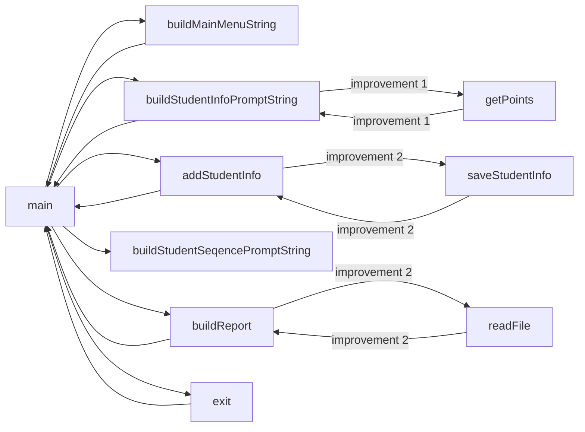

### 任务列表

1. 打印主菜单
2. 添加学生成绩
3. 生成成绩单
4. 退出

```mermaid
graph LR;
　　main-->buildMainMenuString
　　buildMainMenuString-->main
　　buildStudentInfoPromptString--improvement 1-->getPoints
　　getPoints--improvement 1-->buildStudentInfoPromptString
　　main-->buildStudentInfoPromptString
　　buildStudentInfoPromptString-->main
　　main-->addStudentInfo
　　addStudentInfo-->main
　　addStudentInfo--improvement 2-->saveStudentInfo
　　saveStudentInfo--improvement 2-->addStudentInfo
　　main-->buildStudentSeqencePromptString;
　　main-->buildReport
　　buildReport-->main
　　buildReport--improvement 2-->readFile
　　readFile--improvement 2-->buildReport
　　main-->exit
　　exit-->main
```

